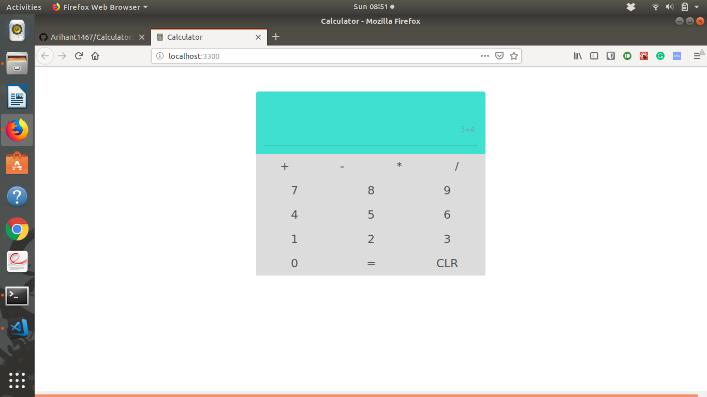

# Calculator
A Calculator app using React JS and Node JS

# Start the Project

#### Start the frontend
```
cd Calculator/calcualtor-frontend/
npm install
npm start
```

#### Start the backend
```
cd Calculator/calculator-backend
npm install
node app.js
```

# Custom Port Specification
<table>
  <tr>
    <th colspan="3"><h3>Custom Port Specification</h3></th>
  </tr>
  <tr>
    <td><b>Part</b></td>
    <td><b>Port</b></td>
    <td><b>Link</b></td>
  </tr>
  <tr>
    <td>calculator-frontend</td>
    <td><b>3300</b></td>
    <td><a href="http://localhost:3300/">http://localhost:3300/</a></td>
  </tr>
  <tr>
    <td>calculator-backend</td>
    <td><b>3301</b></td>
    <td><a href="http://localhost:3301/">http://localhost:3301/</a></td>
  </tr>
</table>

# Screenshots
